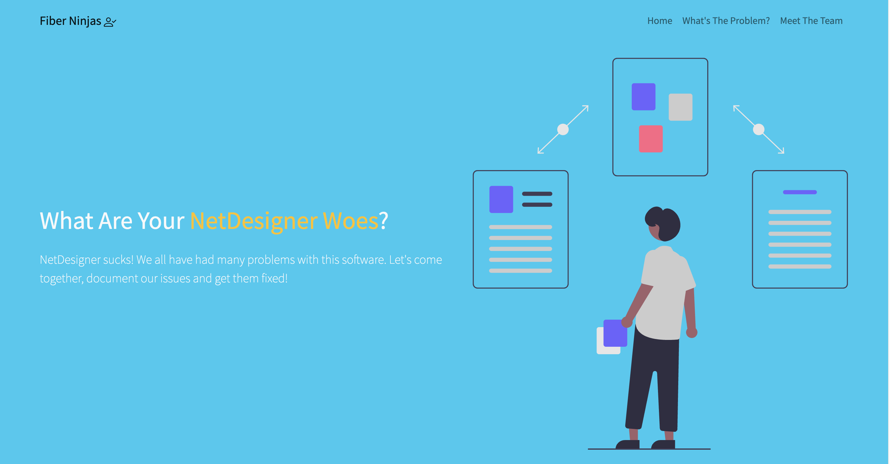

# Netdesigner Woes 

Our fiber documentation software at work leaves less than to be desired. I wanted to create a visually pleasing, user-friendly web app to keep track of our "woes".

**Link to project:** 
[Netdesigner Woes](https://netdesigner-woes.herokuapp.com/)

## How It's Made:

**Tech used:** HTML, CSS, JavaScript, Bootstrap, MongoDB and Node.js

I wanted to make it so we wouldn't have to share an excel file via email. Or go to an editable excel. Excels are great we just use them for everything. 

## Issues 
- I am not a designer, I have to figure out how I want the data to be displayed once input.  
- When using `placeholder` on edit screen, it would be just that a placeholder and the data would be "erased" if I didn't update that field.
- When using `required` in mongoose, it would show an error on submit but made the user feel like submit worked until they read the error. 
- When I have more time, I want to re-attack the edit page. On smaller screens the table stretches across the screen. I could make the table "responsive" in Bootstrap but it would make a horizontal scroll on the table. I may change it from a table to something more flex/responsive friendly. 

## Optimizations

- Utilized free MongoDB cluster with a new db.
- Got some good practice with Bootstrap to make a this web app responsive. 
- Refactored code to have `required` as HTML attribute for a cleaner UI in both index.ejs and edit.js.
- Removed `placeholder` on `edit.ejs` and changed to `value` so the content in that field stays when you resubmit your edits if you don't make a change. 

## Lessons Learned:

- Install nodemon --dev was a lifesaver whenever I made changes to my server.js! 
- Don't try to do too much at once. Always build a little, TEST, save and push my code. 
- While you can use the `required` method in mongoose, the error doesn't look as "nice" on the screen as the built-in browser errors on fields you want populated. 

## Steps to set up a project: 
To be continued. 

