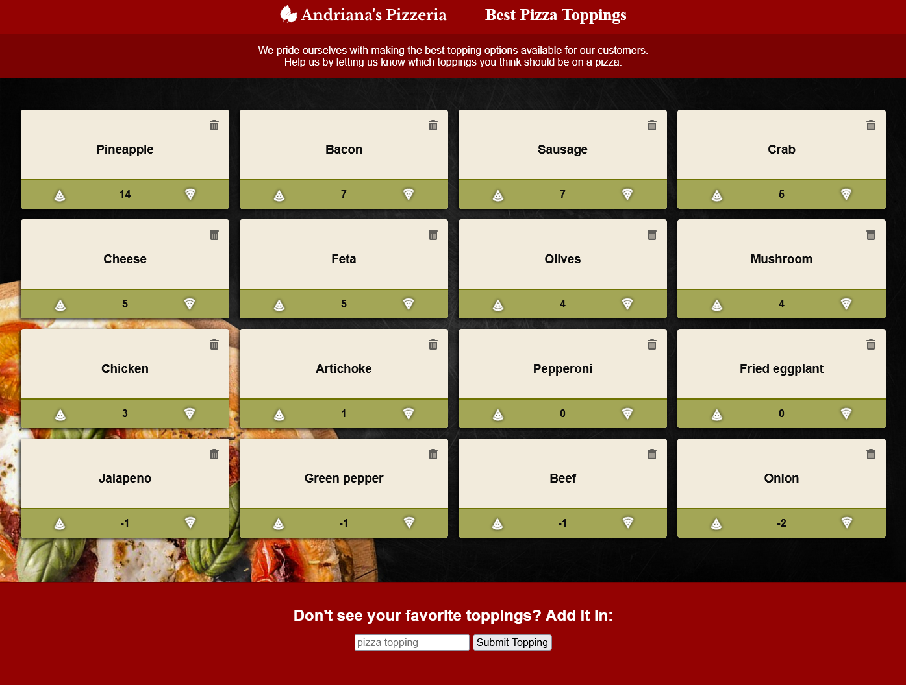

# Simple Pizza CRUD App Prototype

<h3 align="center">
    &#x2B21;
    <a href="https://github.com/NeffCodes/pizza-crud/issues">Report Bug</a> &nbsp; &nbsp;
    &#x2B21;
    <a href="https://github.com/NeffCodes/pizza-crud/issues">Request Feature</a>
</h3>

____

This is a simple CRUD app to see what toppings truly belong on a pizza. Users are able to vote on, change their vote, and add what toppings they like.

**Link to project:** [https://ultimate-pizza-toppings.herokuapp.com/](https://ultimate-pizza-toppings.herokuapp.com/)

## 💻 Tech Used

- Web browser, ie HTML, CSS, JS
- Node.js: Environment for running Javascript serverside
- Express: Web framework for Node
- MongoDB Atlas: Cloud database
- EJS: Templating language

## 📚 Lessons Learned

I got to dive more into learning how to use CRUD (Create, Read, Update, Delete) operations to handling of information from a database.

## 💡 Contributing

Found an issue or want to add a cool feature to this site? Awesome! Leave a comment in the issues tab and I will assign it to you.

1. Comment in the issues [tab](https://github.com/NeffCodes/pizza-crud/issues)
2. Fork or clone this repo
3. Build the code you wish to add
4. Create a pull request
