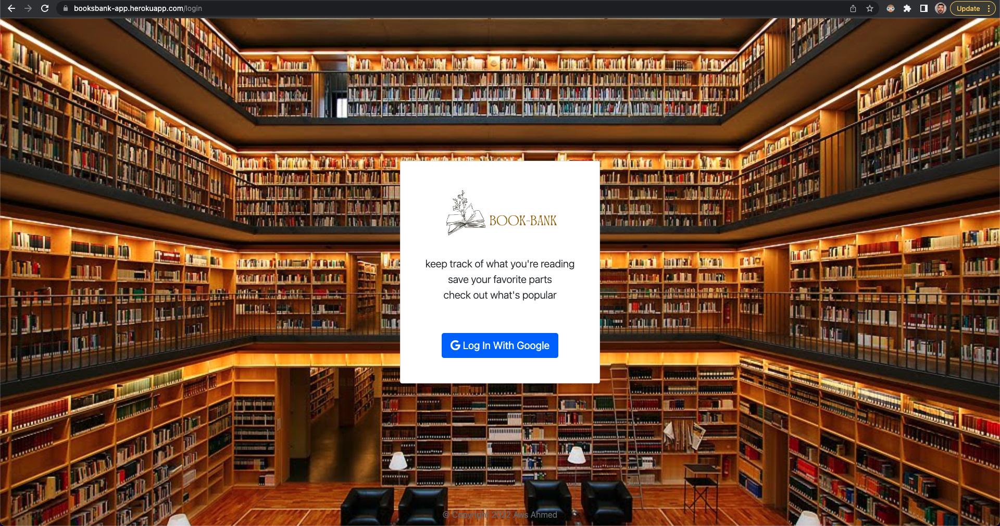
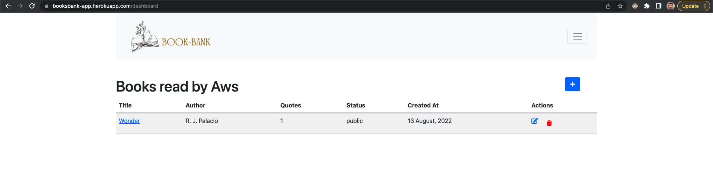
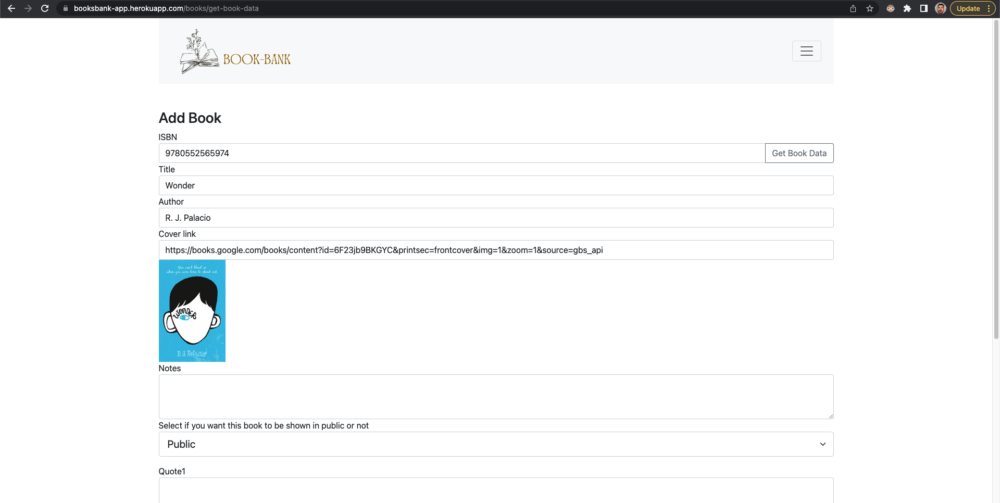
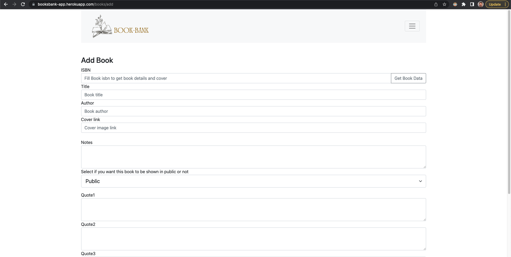

# book_bank

## Description:

This App is about keep track of what you're reading, save your favorite parts, check out what's popular.

## App link: https://booksbank-app.herokuapp.com/

### App flow:

the app main page listing the books read by people with brief note and list of quotes each card have the user name which you can click on it to filter out the books to the specific user books list, also there is a more link to go to the specific book full details

if you want to add a new book go to dashboard which you can not go to it unless you logged in with your google account

once you logged in you can add edit remove book with details

in the add book page you can enter just the book ISDN and the app will try to bring book data from google book api if the book is not availabel you can enter book details manually

## images from the app

<!--  { width: 200px; } -->

### login page

### all books list

### Dashboard

### Add book with ISBN

### Add book

