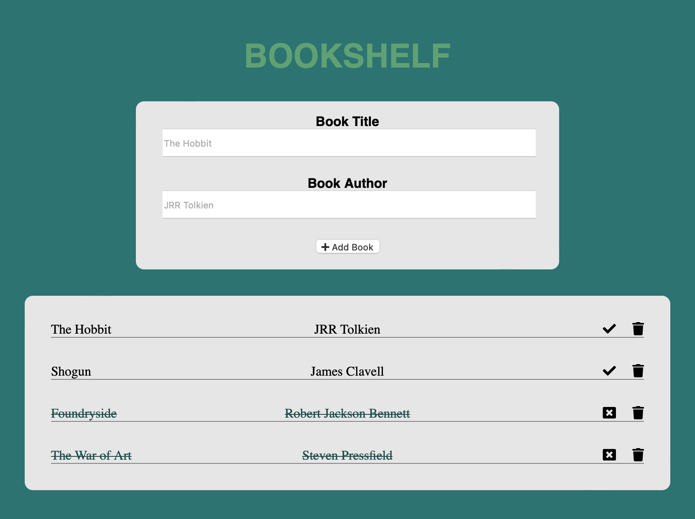

# BOOKSHELF | 100Devs Simple Express App

Keep track of your book list. When you are done reading a book, make sure that you mark it *Finished*!

 

## Tech Used:
HTML, CSS, Node, EJS

 

## Optimizations
- Sort *finished* books to the bottom of the list.
- Add option for user to add a rating or note.
- Include book cover for each book added to Bookshelf.
- Add search feature for books added to Bookself.

 

