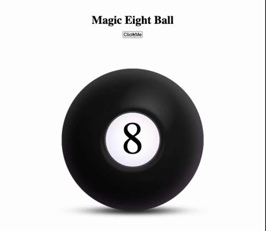

## Contributors

Aaron Clamp [@ronaldconn](https://github.com/ronaldconn) and Poornima P K [@poornimapk](https://github.com/poornimapk)

# Magic 8 Ball
This Magic 8 Ball looks into your future to find answers to your questions. Ask your question and click the button, your future will be revealed!

# How It's Made:
**Tech used:** HTML, CSS, JavaScript, Node.js

The magic eight ball pulls fortunes at random from a hosted database.

# Optimizations
Ideally this app would have a more streamlined GUI. As it is, it works to get the user a fortune, but the refresh rate is not ideal. There are two main animations: (1) procuring the fortune (2) returning the eight ball to a pre-fortune state.

Following the first fortune selection, the refresh occurs automatically on a set timer. However, ideally there will be a third animation that procures a new fortune after the first fortune is animated and shown disappearing.

This will be more seamless and feel better and less "chunky"

# Lessons Learned:
This app challenged us to keep our code as dry as possible and impeded our databases within our back-end js files. We had to make sure that all that information was abstracted from the user as well. We had the most fun experiementing with animations for the eightball. Like a coastal shelf, CSS is a continually deepening puzzle. I hope you enjoy our app. :)
